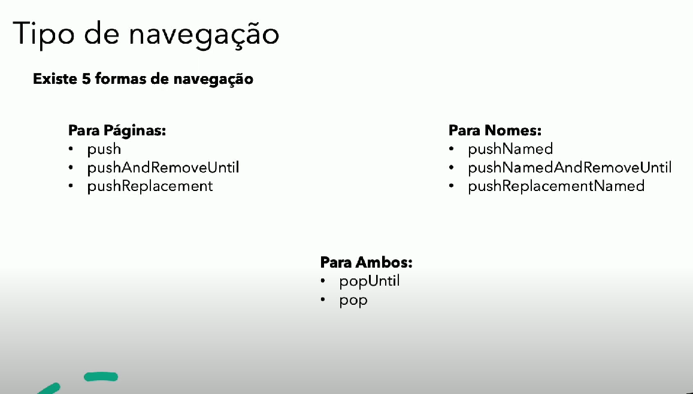
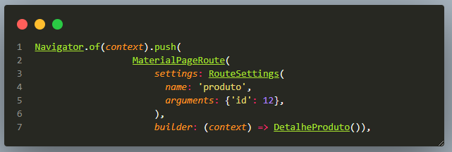
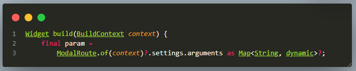

<h1 align="center">ATIVIDADES DESENVOLVIDAS NO CURSO DA ACADEMIA DO FLUTTER</h1>

 Flutter ( Mão na massa).

### » TÓPICOS ESTUDADOS E CONSOLIDADOS:

- Principais Widget: Scaffold, MaterialApp, ThemeData, Drawer, AppBar, Center, Container;
- Imagens: DecorationImage, AssetImage, configurando Assets de imagens no yaml;
- Customizando fontes no yaml;
- rotas de navegação:
 
    
- Há duas formas básicas de navegação, por meio de PÁGINAS ou NOMES.

- Comando de navegação por páginas:

    > push: Abri uma página especifica e mantem a página anterior ativa por trás,empilhada.

    > pushAndRemoveuntil: remove as páginas ativas empilhadas;

    > pushReplacement: Substitui a página atual por outra;

    > 
- Comando de navegação por nomes, tem a mesma funcionalidade dos comandos de nabegação por página: 
    > pushNamed;

    > PushNamedAndRemoveuntil;

    > PushReplacementNamed;

- Enviado dados de uma página pra outra;
    
    

### Autor

